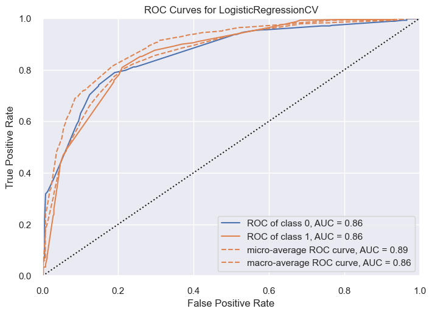
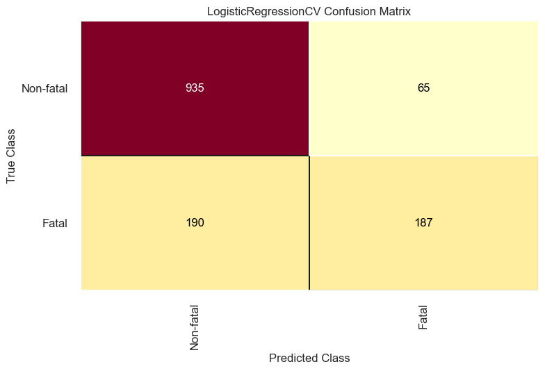

# Air_Travel_Safety_Analysis

* dataset link:
* * https://www.kaggle.com/datasets/deepcontractor/aircraft-accidents-failures-hijacks-dataset

# Intro

* Individual aircraft incidents and associated factors

* Data covers the time period of 2000 to 2022

* Primarily categorical data that required significant cleaning to be useable

* Ground casualty figures were excluded as most were purely coincidental

* Includes military, private, passenger, and cargo flights 

# Data vizualized

* Percent of non-fatal incidents is: 73.6%
* Percent of fatal incidents is: 26.4%

* Percent of fatal incidents where some occupants survived: 32.7%
* Percent of fatal incidents where all occupants were lost: 67.3%

# Hypothesis

Null: Incident causes have no influence on fatal occurrences

Alternate: Incident causes have a significant influence on fatal occurrences

# Conlusion:

* Null Hypothesis is rejected 

* Alternate hypothesis is accepted:
* * Incident causes have a significant influence on fatal occurences

